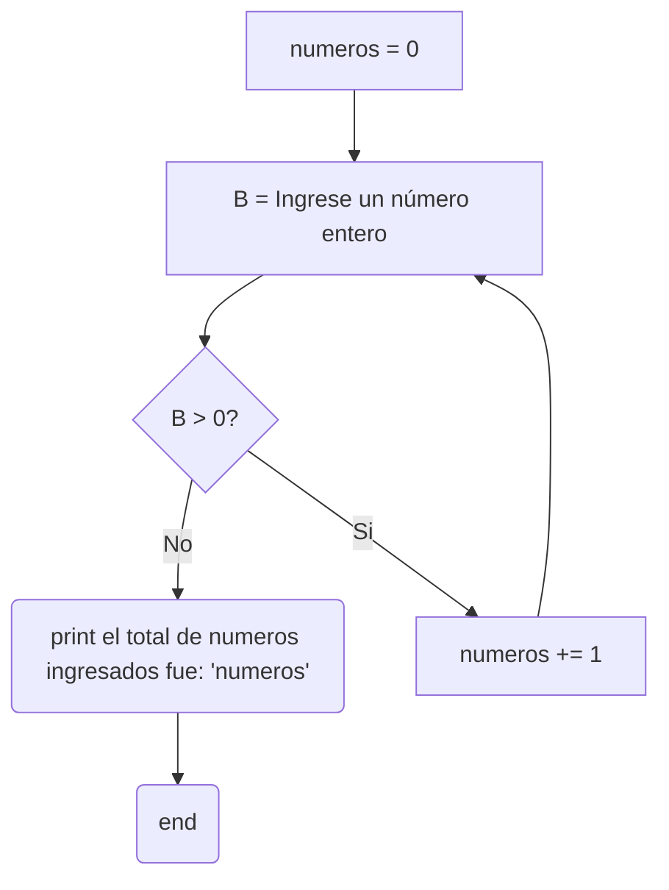

# 10) Ingresar números enteros en la variable B y, MIENTRAS el valor ingresado en B sea
POSITIVO, calcular la cantidad de números ingresados e imprimirla en un mensaje.


```python
numeros = 0
B = int(1)
while B > 0:
    B = int(input("Ingrese numero entero... "))
    numeros += 1
print(numeros)
```