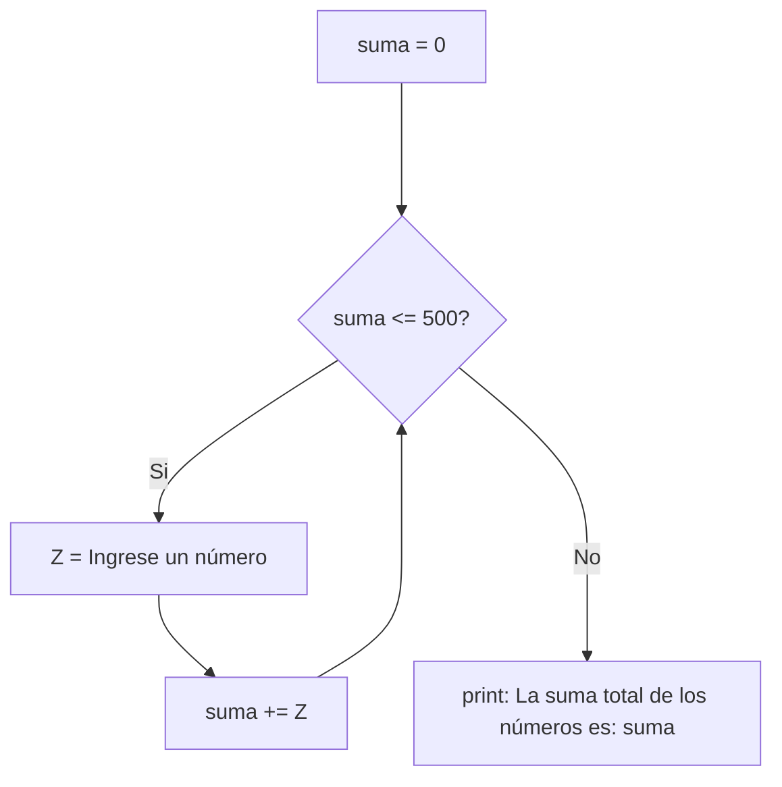

#11) Ingresar números enteros en la variable Z, HASTA que la suma de los valores ingresados en Z
sea mayor a 500. Determinar e imprimir la cantidad de números ingresados. 


```python
suma = 0
while suma <= 500:
    Z = int(input("Ingrese un número "))
    suma += Z
print(f"La suma total de los número ingresados es: {suma}")
```