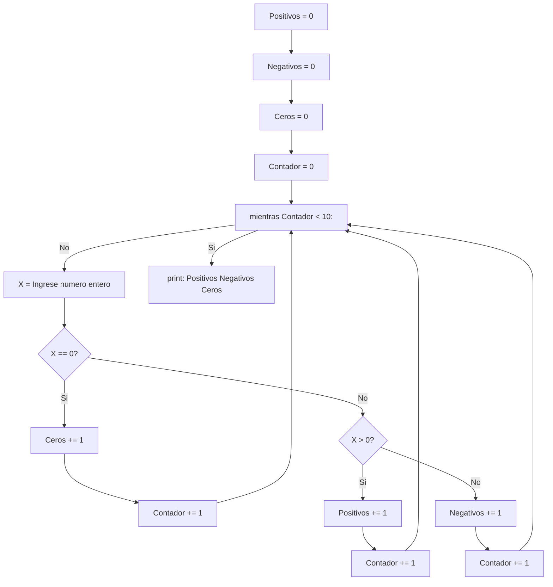

# 12) Ingresar 10 números enteros usando la variable X. Determinar e imprimir un mensaje informando:
# la cantidad de números POSITIVOS, la cantidad de números NEGATIVOS y, la cantidad de CEROS ingresados.

```python
Positivos = 0
Negativos = 0
Ceros = 0
Contador = 0
while Contador < 10:
    X = int(input("Ingrese un numero entero"))
    if X == 0:
        Ceros += 1
        Contador += 1
    elif X > 0:
        Positivos += 1
        Contador += 1
    else:
        Negativos += 1
        Contador += 1
print(f"Total: positivos: {Positivos} negativos: {Negativos} y ceros: {Ceros}")
```