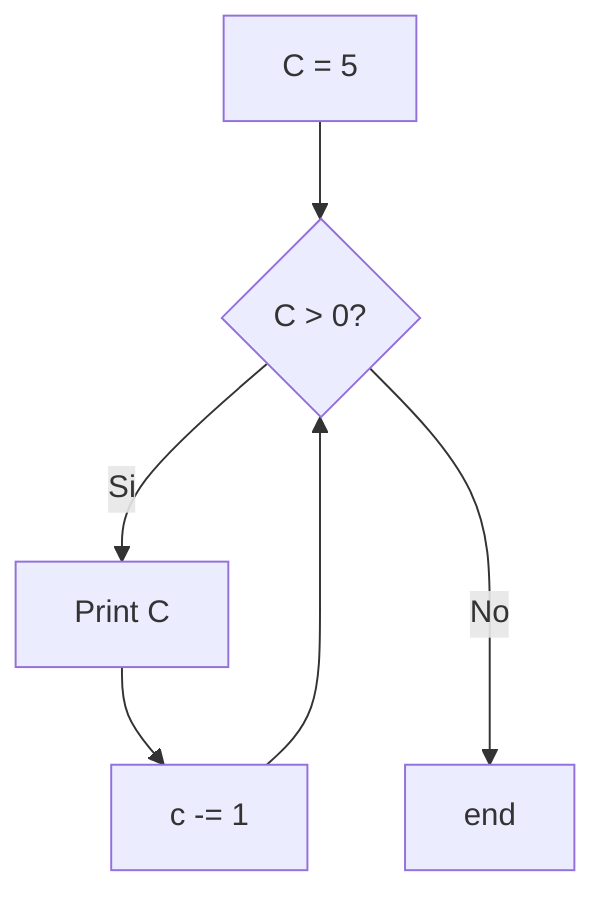

## 5) Escriba un diagrama de flujo que permita generar e imprimir los primeros 5 números naturales en orden descendente (a partir de 5). 


```python
c = -1
while c > -6:
    print(c)
    c -= 1
```
