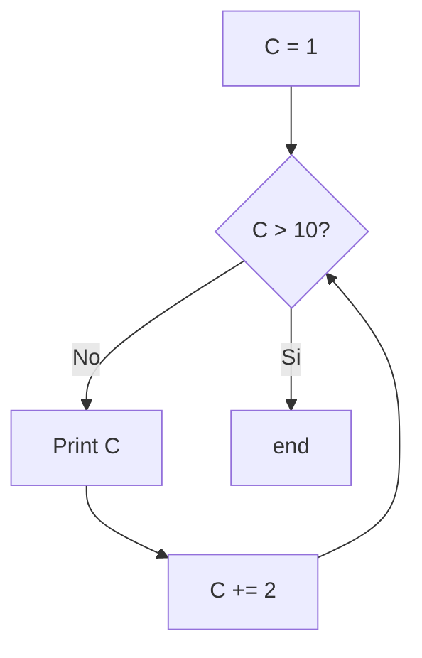

## 7) Escriba un diagrama de flujo que permita generar e imprimir los primeros 5 números naturales
impares (a partir de 1). 

```mermaid
flowchart TD
A[C = 1] --> B{C > 10?}
    B --> |No| C[Print C]
    C -->  D[C += 2]
    D --> B
    B -->|Si| F[end]
```

```python 
c = 1
while c < 10:
    print(c)
    c += 2
```

