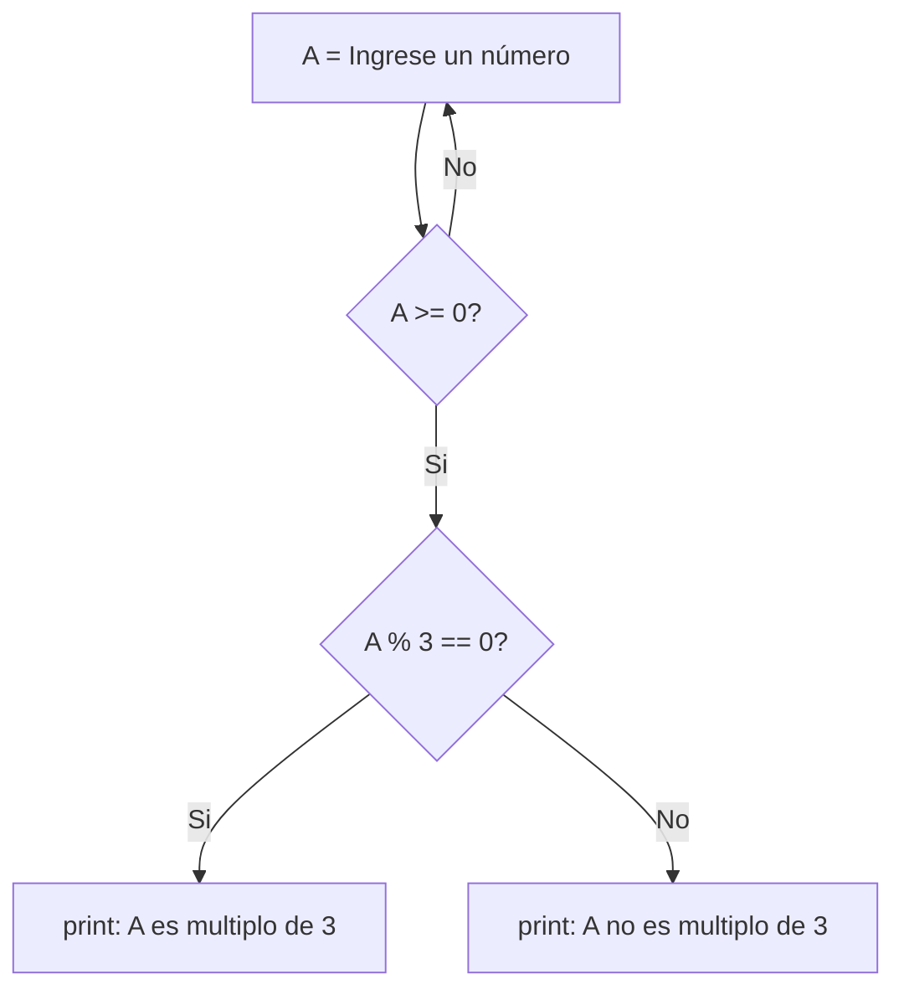

## 9) Ingresar un número natural en la variable A. Determinar e imprimir un mensaje informando: si A
es múltiplo de 3 o no. 


```python
A = int(input("Ingrese un número "))
assert A >= 0, "El número debe ser positivo"
if A % 3 == 0:
    print(f"{A} es múltiplo de 3")
else:
    print(f"{A} no es múltiplo de 3")
```