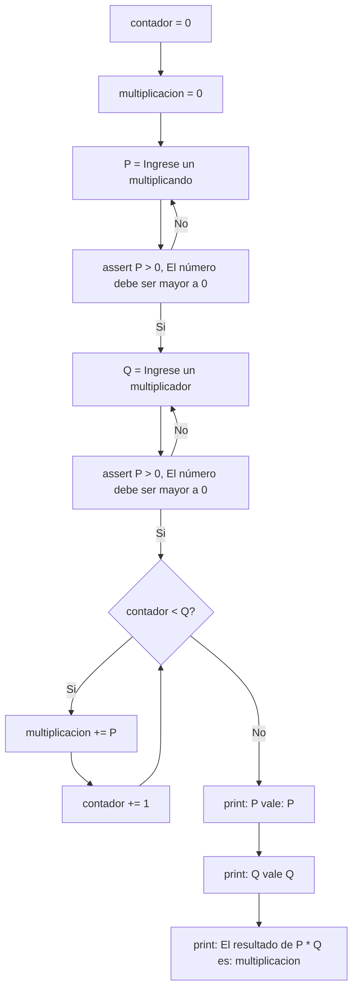

## 13) Ingresar 2 números naturales P y Q, donde P representa el multiplicando y Q el multiplicador.
## Se pide que, utilizando solamente la operación de suma, calcule el resultado de la operación P * Q
## e imprima el valor de P, de Q y de P * Q.


```python
contador = 0
multiplicacion = 0
P = int(input("Ingrese el multiplicando "))
assert P >= 0, "El multiplicando debe ser positivo"
Q = int(input("Ingrese el multiplicador "))
assert Q >= 0, "El multiplicador debe ser positivo"
while contador < Q:
    multiplicacion += P
    contador += 1
print(f"P vale: {P}")
print(f"Q vale: {Q}")
print(f"El resultado de P * Q es: {multiplicacion}")
```