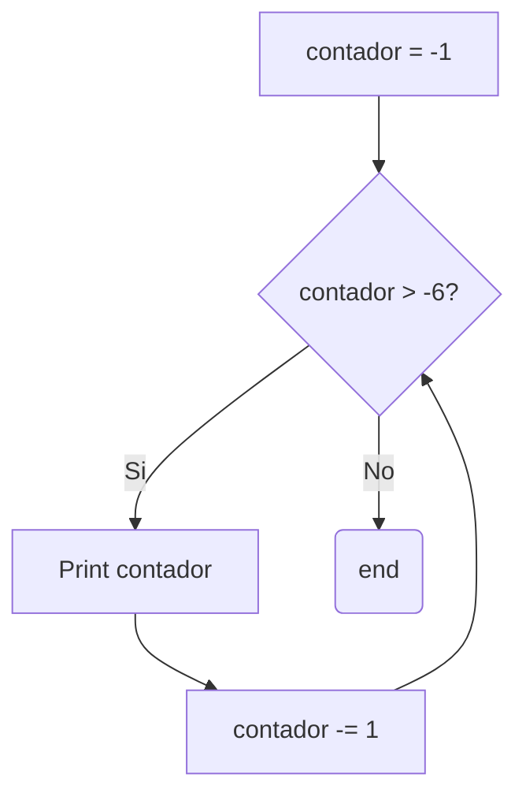

## 4) Escriba un diagrama de flujo que permita generar e imprimir los primeros 5 números enteros negativos

```mermaid
flowchart TD
    A[contador = -1] --> B{contador > -6?}
    B --> |Si| C[Print contador]
    C --> D[contador -= 1]
    D --> B
    B -->|No| F(end)
```
```python
contador = -1
while contador > -6:
    print(contador)
    contador -= 1
```