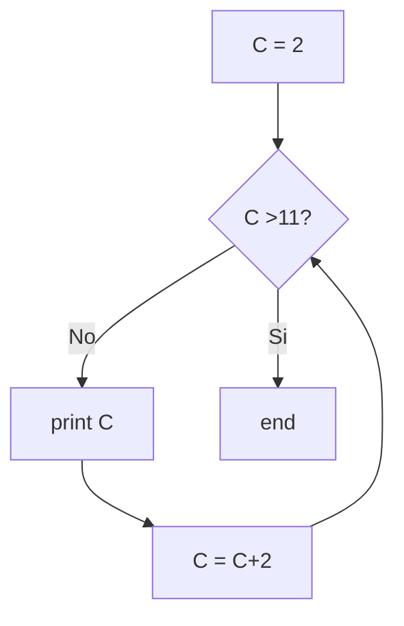

## 6) Escriba un diagrama de flujo que permita generar e imprimir los primeros 5 números naturales 
## pares (a partir de 2).

```mermaid
flowchart TD
	A[C = 2] --> B{C >11?}
	B --> |No| C[print C]
	C --> D[C = C+2]
	D --> B
	B --> |Si| E[end]
```

```python
c = 2
while c < 11:
    print(c)
    c += 2
```