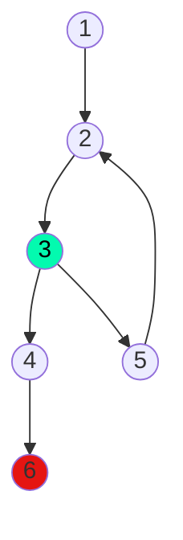

# 10) Ingresar números enteros en la variable B y, MIENTRAS el valor ingresado en B sea POSITIVO, calcular la cantidad de números ingresados e imprimirla en un mensaje.

Calculo ciclomático: |
---------------------|
Nodos = 6 |
Aristas = 6 |
Regiones = 2 |
Aristas - nodos + 2 = 2 |
Nodos predicados + 1 = 2 |

Caminos posibles: |
------------------|
 1, 2, 3, 4, 6 |
 1, 2, 3, 5, 2 ... |
 1, 2, 3, 5, 2, 3, 4, 6 |
