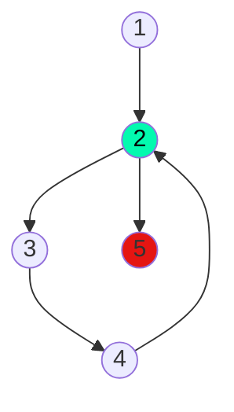

## 11) Ingresar números enteros en la variable Z, HASTA que la suma de los valores ingresados en Z sea mayor a 500. Determinar e imprimir la cantidad de números ingresados. 

Calculo ciclomático: |
---------------------|
Nodos = 5 |
Aristas = 5 |
Regiones = 2 |
Aristas - nodos + 2 = 2 |
Nodos predicados + 1 = 2 |

Caminos posibles: |
------------------|
 1, 2, 3, 4, 2 ..., 5 |
