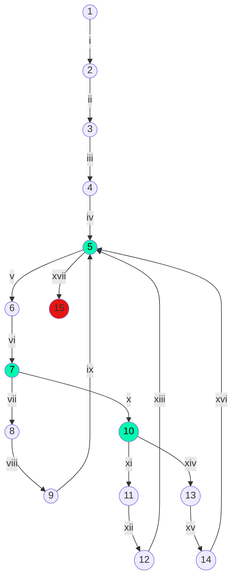

# 12) Ingresar 10 números enteros usando la variable X. Determinar e imprimir un mensaje informando: la cantidad de números POSITIVOS, la cantidad de números NEGATIVOS y, la cantidad de CEROS ingresados.

Calculo ciclomático: |
---------------------|
Nodos = 15 |
Aristas = 17 |
Regiones = 4 |
Aristas - nodos + 2 = 4 |
Nodos predicados + 1 = 4 |

Caminos posibles: |
------------------|
 1, 2, 3, 4, 5, 6, 7, 8, 9, 5 ..., 15 |
 1, 2, 3, 4, 5, 6, 7, 10, 11, 12, 5 ..., 15 |
 1, 2, 3, 4, 5, 6, 7, 10, 13, 14, 5 ..., 15 |
 1, 2, 3, 4, 5, 6, 7, 8, 9, 5, 6, 7, 10, 11, 12, 5, 6, 7, 10, 13, 14, 5, ..., 15 |
