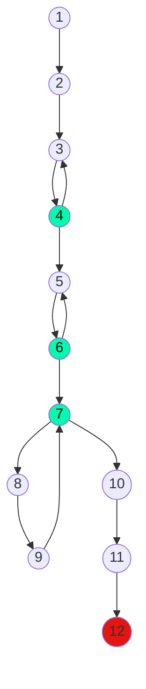

## 13) Ingresar 2 números naturales P y Q, donde P representa el multiplicando y Q el multiplicador.
## Se pide que, utilizando solamente la operación de suma, calcule el resultado de la operación P * Q
## e imprima el valor de P, de Q y de P * Q.

Calculo ciclomático: |
---------------------|
Nodos = 12 |
Aristas = 12 |
Regiones = 2 |
Aristas - Nodos + 2 = 2 |
Nodos predicados + 1 = 2 |

Caminos posibles: |
------------------|
 1, 2, 3, 4, 5, 6, 7, 8, 9, 7...
 1, 2, 3, 4, 5, 6, 7, 10, 11, 12...
