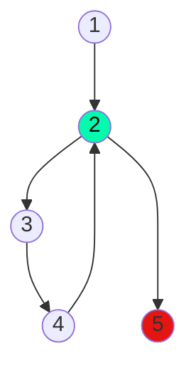

## 7) Escriba un diagrama de flujo que permita generar e imprimir los primeros 5 números naturales
## impares (a partir de 1).

Calculo ciclomático: |
---------------------|
Nodos = 5 |
Aristas = 5 |
Regiones = 2 |
Aristas - nodos + 2 = 2 |
Nodos predicados + 1 = 2 |

Caminos posibles: |
------------------|
 1, 2, 3, 4, 2... |
 1, 2, 5. |