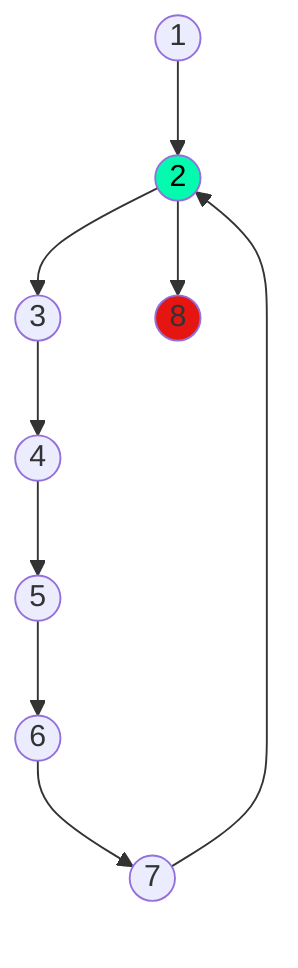

## 8) Escriba un diagrama de flujo que permita ingresar 6 pares de números naturales que representan notas de parciales, en las variables N1 y N2, y que calcule e imprima el promedio de cada par de notas.

Calculo ciclomático: |
---------------------|
Nodos = 8 |
Aristas = 8 |
Regiones = 2 |
Aristas - nodos + 2 = 2 |
Nodos predicados + 1 = 2 |

Caminos posibles: |
------------------|
 1, 2, 3, 4, 5, 6, 7, 2..., 8 |