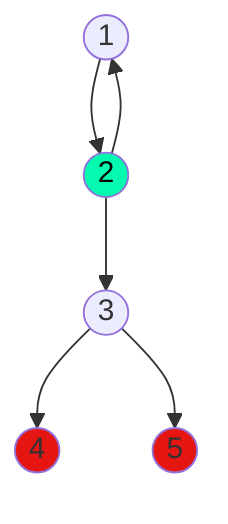

## 9) Ingresar un número natural en la variable A. Determinar e imprimir un mensaje informando: si A es múltiplo de 3 o no. 

Calculo ciclomático: |
---------------------|
Nodos = 5 |
Aristas = 5 |
Regiones = 2 |
Aristas - nodos + 2 = 2 |
Nodos predicados + 1 = 2 |

Caminos posibles: |
------------------|
 1, 2... |
 1, 2, 3, 4 |
 1, 2, 3, 5 |